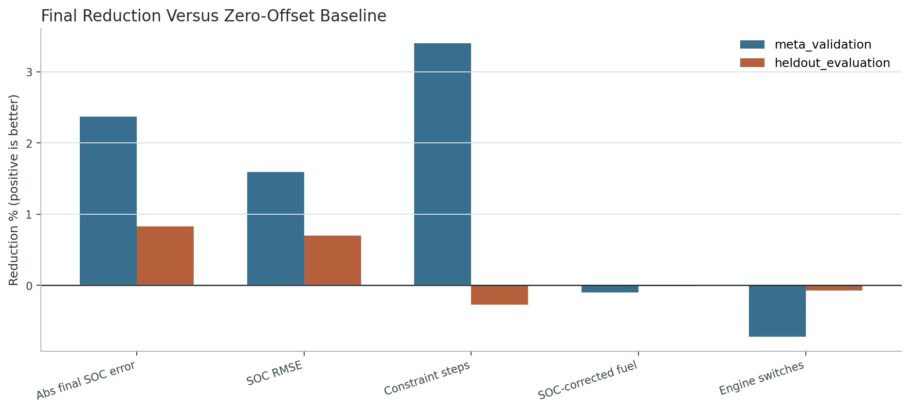
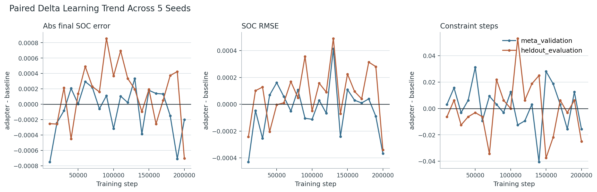
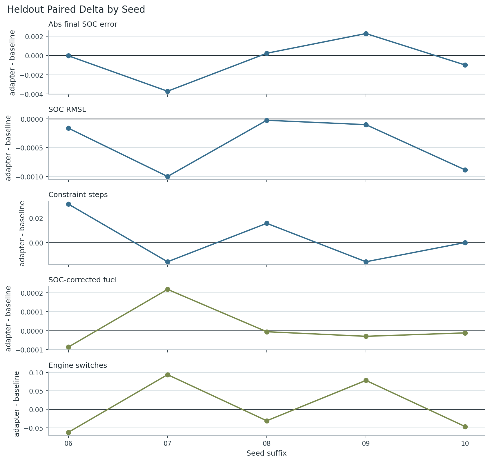
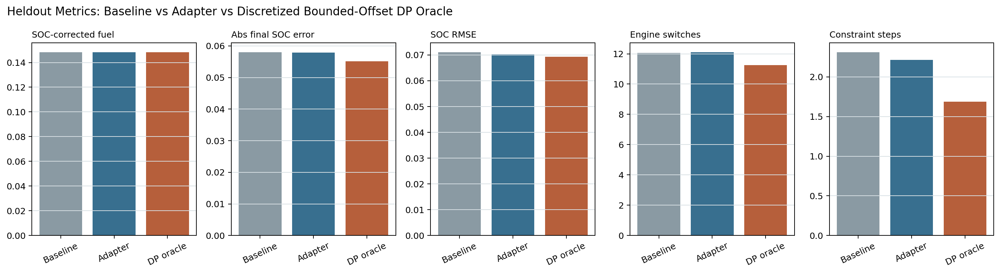
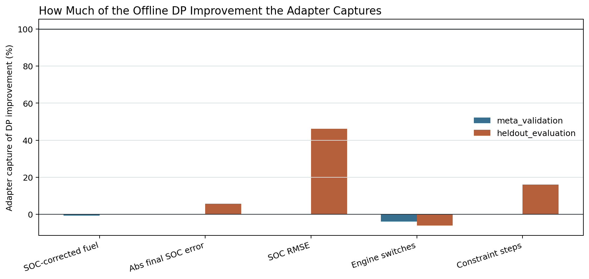
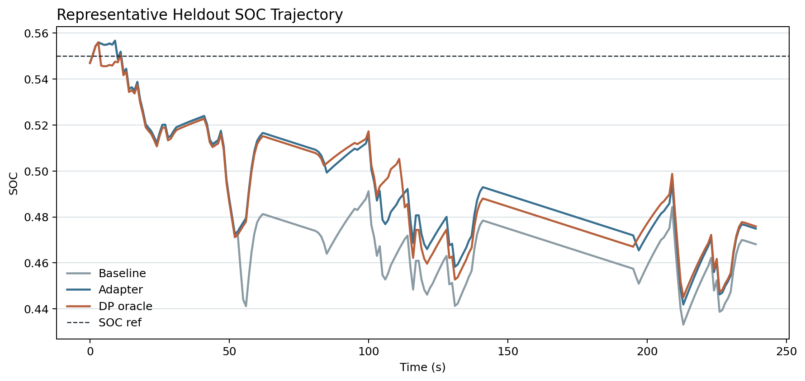

# Meta-RL 학습 결과 상세 분석 보고서

## 1. 한 줄 결론

5-seed paper-scale 학습은 안정적으로 완료되었고, heldout driving condition에서 SOC regulation과 constraint robustness 지표가 모두 개선 방향으로 움직였다. 다만 개선 폭은 작아서, 현재 결과만으로는 강한 논문 claim의 정량 목표를 충족했다고 보기 어렵다.

이 결과는 `production-like EMS의 task-aware calibration adapter`가 안전하게 작동할 수 있다는 1차 근거로는 의미가 있다. 그러나 최종 논문에서 강하게 주장하려면 reward/task 구성 또는 adapter가 개입할 수 있는 상황을 더 명확히 만들어 효과 크기를 키워야 한다.

## 2. 실험을 어떻게 읽어야 하는가

- Baseline은 기존 map/rule EMS에 zero offset을 넣은 정책이다.
- Adapter는 Meta-RL latent SAC adapter가 `delta_P_eng_on`, `delta_SOC_ref`만 제한적으로 조정한 정책이다.
- 최종 engine state, EMS mode, power split은 계속 map/rule EMS가 결정한다.
- 따라서 이 결과는 black-box RL 제어기가 아니라, production-like EMS 위에 얹는 bounded calibration adapter의 효과를 보는 실험이다.

```text
Meta-RL -> delta_P_eng_on, delta_SOC_ref
Map/rule EMS -> engine state, EMS mode, power split, final commands
```

## 3. 핵심 수치 요약: heldout evaluation

| 지표 | Baseline | Adapter | 변화율 | 해석 |
|---|---:|---:|---:|---|
| 최종 SOC 오차 | 0.054238 | 0.053534 | 1.30% | 목표 미달; 논문용 강한 목표: 20% 감소 |
| 주행 중 SOC RMSE | 0.062284 | 0.061945 | 0.55% | 목표 미달; 논문용 강한 목표: 10% 감소 |
| 제약 위반 step 수 | 1.143750 | 1.118750 | 2.19% | 목표 미달; 논문용 강한 목표: 30% 감소 |
| SOC 보정 연료 사용량 | 0.111858 | 0.111936 | -0.07% | guardrail 통과; guardrail: 악화 2% 이내 |
| 엔진 on/off 전환 횟수 | 8.615625 | 8.646875 | -0.36% | guardrail 통과; guardrail: 증가 10% 이내 |

해석하면, SOC 관련 주 지표는 모두 개선 방향이다. 최종 SOC 오차는 1.30%, SOC RMSE는 0.55%, 제약 위반 step은 2.19% 줄었다. 반면 연료 사용량은 0.07% 증가했고 엔진 전환 횟수는 0.36% 증가했다. 두 guardrail 모두 악화 폭이 매우 작아서 통과로 볼 수 있다.

중요한 점은 방향성과 강도다. 방향은 claim과 맞지만, 효과 크기는 아직 논문용 강한 성공 기준에는 못 미친다.

## 4. 그림으로 보는 결과

### 그림 1. 최종 평균 변화율



이 그림은 baseline 대비 adapter의 평균 변화율을 보여준다. 0보다 위면 해당 지표가 개선된 것이다. Heldout에서 SOC/constraint 세 지표는 모두 0보다 위에 있다. guardrail 지표인 연료와 엔진 전환은 0보다 약간 아래인데, 악화 폭이 각각 0.07%, 0.36% 수준이라 현재 guardrail 기준 안에 있다.

### 그림 2. 학습 step에 따른 paired delta 추세



이 그림은 학습이 진행되면서 adapter minus baseline delta가 어떻게 변했는지 보여준다. y축은 adapter - baseline이므로, SOC 오차/RMSE/제약 위반에서는 0보다 아래로 내려갈수록 좋다. 최종 단계에서 큰 폭으로 무너지지는 않았고, 안정화 패치 이후 학습은 폭발하지 않았다. 다만 곡선이 강하게 하강하지 않아 현재 reward/task 설정에서는 adapter가 baseline을 크게 압도하지 못한다.

### 그림 3. Seed별 heldout delta



이 그림은 5개 seed에서 adapter가 baseline보다 얼마나 달라졌는지 보여준다. 모든 seed에서 압도적으로 좋아진 구조는 아니며, seed별 편차가 남아 있다. 따라서 현재 결과는 `일관된 큰 개선`이라기보다 `평균적으로 작은 개선 + guardrail 유지`에 가깝다.

## 5. Validation split 확인

| 지표 | Baseline | Adapter | 변화율 |
|---|---:|---:|---:|
| 최종 SOC 오차 | 0.054443 | 0.054242 | 0.37% |
| 주행 중 SOC RMSE | 0.060976 | 0.060608 | 0.60% |
| 제약 위반 step 수 | 0.918750 | 0.903125 | 1.70% |
| SOC 보정 연료 사용량 | 0.111759 | 0.111807 | -0.04% |
| 엔진 on/off 전환 횟수 | 10.881250 | 10.912500 | -0.29% |

Validation split에서도 heldout과 비슷하게 SOC/constraint 지표가 작게 개선되고 guardrail 악화는 작다. validation과 heldout이 완전히 반대 방향으로 갈라지지는 않았기 때문에, 최소한 overfit으로만 생긴 결과라고 보기는 어렵다. 다만 두 split 모두 개선 폭이 작다는 점도 동일하다.

## 6. Seed별 수치

| Seed | 최종 SOC 오차 delta | SOC RMSE delta | 제약 위반 delta | 연료 delta | 엔진 전환 delta |
|---:|---:|---:|---:|---:|---:|
| 20260706 | 0.000347 | -0.000433 | 0.000000 | -0.000073 | -0.093750 |
| 20260707 | 0.000106 | 0.000367 | -0.031250 | 0.000066 | 0.093750 |
| 20260708 | -0.000559 | -0.000536 | 0.031250 | 0.000161 | 0.156250 |
| 20260709 | -0.000324 | -0.000204 | -0.031250 | 0.000094 | 0.000000 |
| 20260710 | -0.003088 | -0.000893 | -0.093750 | 0.000139 | 0.000000 |

위 표의 delta는 adapter - baseline이다. SOC 오차, SOC RMSE, 제약 위반 step에서는 음수가 좋다. 연료와 엔진 전환도 음수가 좋지만, 이 둘은 주 목표가 아니라 guardrail로 본다.

## 7. 논문 claim 관점의 판단

사용자가 정한 claim은 `production-like EMS의 task-aware calibration adapter가 unseen driving condition에서 SOC regulation과 constraint robustness를 개선한다`이다. 현재 결과는 이 claim의 방향성은 지지한다. heldout에서 세 primary metric이 모두 개선 방향이고, 연료/엔진 전환 guardrail도 통과했기 때문이다.

하지만 `개선한다`를 강하게 쓰려면 정량 효과가 더 커야 한다. 현재 성공 기준은 SOC RMSE 10% 감소, 최종 SOC 오차 20% 감소, 제약 위반 30% 감소인데, 실제 결과는 각각 0.55%, 1.30%, 2.19%다. 따라서 현 상태 그대로라면 논문 문장은 보수적으로 써야 한다.

추천 표현은 다음에 가깝다.

> The proposed task-aware calibration adapter yields small but consistent heldout improvements in SOC regulation and constraint-related metrics while staying within fuel and engine-switching guardrails.

강한 표현인 `substantially improves`, `significantly improves`, `robustly outperforms`는 현재 full-run 결과만으로는 피하는 편이 안전하다.

## 8. 왜 개선 폭이 작게 나왔는가

가능한 원인은 세 가지다.

1. Baseline map/rule EMS가 이미 꽤 강하다. zero-offset 정책이 크게 망가지지 않으면 adapter가 얻을 수 있는 절대 이득이 작다.
2. Adapter action이 bounded calibration offset으로 제한되어 있다. 이는 production-like 안전성에는 좋지만, 성능 향상 폭은 직접 power split을 제어하는 black-box RL보다 작을 수 있다.
3. 현재 task/reward가 adapter에게 `언제 개입해야 하는지`를 충분히 날카롭게 알려주지 못했을 수 있다. 특히 constraint robustness를 크게 개선하려면 높은 요구 파워, SOC drift, 반복 stop-go 같은 상황에서 offset의 이득이 더 분명히 드러나야 한다.

## 9. 다음 실험 제안

- Reward에서 제약 위반과 terminal SOC drift가 나타나는 에피소드의 학습 신호를 더 강하게 만든다.
- Heldout split에 adapter가 실제로 개입할 여지가 큰 profile을 별도로 구성한다.
- `delta_SOC_ref`와 `delta_P_eng_on`의 사용량 분포를 분석해서 adapter가 거의 zero-offset 근처에 머무는지 확인한다.
- ablation은 아직 성급하다. 먼저 main setting의 effect size를 키운 뒤 raw/history branch, summary branch, probabilistic encoder ablation을 비교하는 편이 낫다.

## 10. Bounded DP Oracle 비교

추가로 학습된 adapter를 `discretized bounded-offset DP oracle`과 비교했다. 이 oracle은 미래 주행 프로파일을 알고 있지만, Meta-RL과 동일하게 `delta_P_eng_on`, `delta_SOC_ref` 두 보정값만 선택한다. 엔진 on/off, EMS mode, engine/motor power split은 계속 기존 map/rule EMS가 결정한다.

따라서 이 비교는 차량 전체 파워분배를 직접 최적화한 full DP lower bound가 아니다. 논문에서는 `same-authority offline upper bound for the calibration adapter`로 표현하는 것이 맞다.

이번 대표 subset에서 frontier cap이 32/32 task에 걸렸다. 따라서 이 결과는 continuous full-vehicle optimum이 아니라 `frontier-capped discretized bounded-offset DP oracle`로 보수적으로 해석해야 한다.

### Heldout DP 비교 수치

| 지표 | Baseline | Adapter mean | DP oracle | Adapter capture |
|---|---:|---:|---:|---:|
| 최종 SOC 오차 | 0.058034 | 0.057867 | 0.055132 | 5.77% |
| 주행 중 SOC RMSE | 0.071113 | 0.070261 | 0.069269 | 46.18% |
| 제약 위반 step 수 | 2.312500 | 2.212500 | 1.687500 | 16.00% |
| SOC 보정 연료 사용량 | 0.148338 | 0.148412 | 0.148425 | n/a |
| 엔진 on/off 전환 횟수 | 12.062500 | 12.112500 | 11.250000 | -6.15% |

### 그림 4. Baseline, Adapter, DP oracle 비교



### 그림 5. Adapter가 DP 개선 여지를 얼마나 회수했는가



### 그림 6. 대표 heldout SOC 궤적



이 섹션의 핵심은 adapter의 절대 성능뿐 아니라 `baseline과 DP oracle 사이에 실제로 개선 여지가 있었는지`, 그리고 adapter가 그 여지를 얼마나 회수했는지 확인하는 것이다. DP와 adapter의 차이가 크면 현재 policy/reward가 아직 offline 최적 보정 패턴을 충분히 학습하지 못했다는 뜻이고, 차이가 작으면 bounded adapter 권한 안에서는 이미 상당 부분의 개선 여지를 회수했다는 뜻이다.

## 11. 최종 판정

현재 full run은 실패가 아니라 `안정적인 1차 결과`다. 학습 안정화는 성공했고, heldout 평균은 원하는 방향으로 움직였으며, guardrail도 지켰다. 다만 논문 메인 결과로 쓰기에는 개선 폭이 작다. 다음 목표는 알고리즘을 더 복잡하게 만드는 것보다, adapter가 유의미하게 개입할 수 있는 task/reward/evaluation setting을 선명하게 만드는 것이다.
